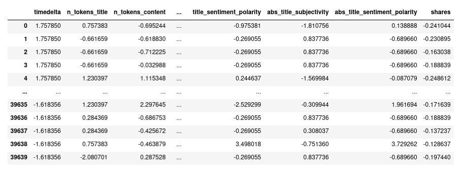
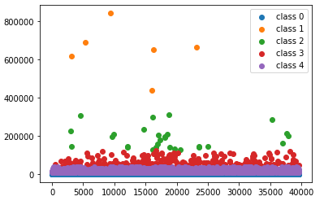
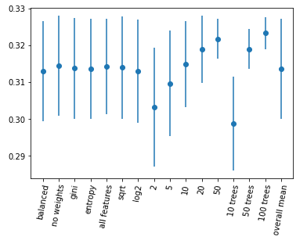

# Machine Learning Challenge
Machine Learning course 2021-2022, Computer Science Department.<br>
Masters' Degree in Applied Mathematics, 
Sapienza University of Rome. <br>
Exam date: June 13th 2022

# Dataset and task description:
The provided [dataset](https://github.com/SofiaTorchia/ML-challenge/blob/master/OnlineNewsPopularity.csv)
is a modified noisy version of
the original dataset described in [1].<br>
This dataset summarizes a heterogeneous set of features about articles published by Mashable in a period of two years. The goal of the task is to predict the number of shares in social networks (popularity).


Here is a brief description of the dataset's features:
<table>
 <tr><th> index </th><th>name</th><th>description</th></tr>
 <tr><td>0</td><td>url</td><td>URL of the article</td></tr>
 <tr><td>1</td><td>timedelta</td><td>Days between the article publication and the dataset acquisition</td></tr>
 <tr><td>2</td><td>n_tokens_title</td><td>Number of words in the title</td></tr>
 <tr><td>3</td><td>n_tokens_content</td><td>Number of words in the content</td></tr>
 <tr><td>4</td><td>n_unique_tokens</td><td>Rate of unique words in the content</td></tr>
 <tr><td>5</td><td>n_non_stop_words</td><td>Rate of non-stop words in the content</td></tr>
 <tr><td>6</td><td>n_non_stop_unique_tokens</td><td>Rate of unique non-stop words in content</td></tr>
 <tr><td>7</td><td>num_hrefs</td><td>Number of links</td></tr>
 <tr><td>8</td><td>num_self_hrefs</td><td>Number of links to other articles published by Mashable</td></tr>
 <tr><td>9</td><td>num_imgs</td><td>Number of images</td></tr>
 <tr><td>10</td><td>num_videos</td><td>Number of videos</td></tr>
 <tr><td>11</td><td>average_token_length</td><td>Average length of the words in the content</td></tr>
 <tr><td>12</td><td>num_keywords</td><td>Number of keywords in the metadata</td></tr>
 <tr><td>13</td><td>data_channel_is_lifestyle</td><td>Is data channel 'Lifestyle'?</td></tr>
 <tr><td>14</td><td>data_channel_is_entertainment</td><td>Is data channel 'Entertainment'?</td></tr>
 <tr><td>15</td><td>data_channel_is_bus</td><td>Is data channel 'Business'?</td></tr>
 <tr><td>16</td><td>data_channel_is_socmed</td><td>Is data channel 'Social Media'?</td></tr>
 <tr><td>17</td><td>data_channel_is_tech</td><td>Is data channel 'Tech'?</td></tr>
 <tr><td>18</td><td>data_channel_is_world</td><td>Is data channel 'World'?</td></tr>
 <tr><td>19</td><td>kw_min_min</td><td>Worst keyword (min. shares)</td></tr>
 <tr><td>20</td><td>kw_max_min</td><td>Worst keyword (max. shares)</td></tr>
 <tr><td>21</td><td>kw_avg_min</td><td>Worst keyword (avg. shares)</td></tr>
 <tr><td>22</td><td>kw_min_max</td><td>Best keyword (min. shares)</td></tr>
 <tr><td>23</td><td>kw_max_max</td><td>Best keyword (max. shares)</td></tr>
 <tr><td>24</td><td>kw_avg_max</td><td>Best keyword (avg. shares)</td></tr>
 <tr><td>25</td><td>kw_min_avg</td><td>Avg. keyword (min. shares)</td></tr>
 <tr><td>26</td><td>kw_max_avg</td><td>Avg. keyword (max. shares)</td></tr>
 <tr><td>27</td><td>kw_avg_avg</td><td>Avg. keyword (avg. shares)</td></tr>
 <tr><td>28</td><td>self_reference_min_shares</td><td>Min. shares of referenced articles in Mashable</td></tr>
 <tr><td>29</td><td>self_reference_max_shares</td><td>Max. shares of referenced articles in Mashable</td></tr>
 <tr><td>30</td><td>self_reference_avg_sharess</td><td>Avg. shares of referenced articles in Mashable</td></tr>
 <tr><td>31</td><td>weekday_is_monday</td><td>Was the article published on a Monday?</td></tr>
 <tr><td>32</td><td>weekday_is_tuesday</td><td>Was the article published on a Tuesday?</td></tr>
 <tr><td>33</td><td>weekday_is_wednesday</td><td>Was the article published on a Wednesday?</td></tr>
 <tr><td>34</td><td>weekday_is_thursday</td><td>Was the article published on a Thursday?</td></tr>
 <tr><td>35</td><td>weekday_is_friday</td><td>Was the article published on a Friday?</td></tr>
 <tr><td>36</td><td>weekday_is_saturday</td><td>Was the article published on a Saturday?</td></tr>
 <tr><td>37</td><td>weekday_is_sunday</td><td> Was the article published on a Sunday?</td></tr>
 <tr><td>38</td><td>is_weekend</td><td>Was the article published on the weekend?</td></tr>
 <tr><td>39</td><td>LDA_00</td><td>Closeness to LDA topic 0</td></tr>
 <tr><td>40</td><td>LDA_01</td><td>Closeness to LDA topic 1</td></tr>
 <tr><td>41</td><td>LDA_02</td><td>Closeness to LDA topic 2</td></tr>
 <tr><td>42</td><td>LDA_03</td><td>Closeness to LDA topic 3</td></tr>
 <tr><td>43</td><td>LDA_04</td><td>Closeness to LDA topic 4</td></tr>
 <tr><td>44</td><td>global_subjectivity</td><td>Text subjectivity</td></tr>
 <tr><td>45</td><td>global_sentiment_polarity</td><td>Text sentiment polarity</td></tr>
 <tr><td>46</td><td>global_rate_positive_words</td><td>Rate of positive words in the content</td></tr>
 <tr><td>47</td><td>global_rate_negative_words</td><td> Rate of negative words in the content</td></tr>
 <tr><td>48</td><td>rate_positive_words</td><td>Rate of positive words among non-neutral tokens</td></tr>
 <tr><td>49</td><td>rate_negative_words</td><td>Rate of negative words among non-neutral tokens</td></tr>
 <tr><td>50</td><td>avg_positive_polarity</td><td>Avg. polarity of positive words</td></tr>
 <tr><td>51</td><td>min_positive_polarity</td><td>Min. polarity of positive words</td></tr>
 <tr><td>52</td><td>max_positive_polarity</td><td>Max. polarity of positive words</td></tr>
 <tr><td>53</td><td>avg_negative_polarity</td><td>Avg. polarity of negative words</td></tr>
 <tr><td>54</td><td>min_negative_polarity</td><td>Min. polarity of negative words</td></tr>
 <tr><td>55</td><td>max_negative_polarity</td><td>Max. polarity of negative words</td></tr>
 <tr><td>56</td><td>title_subjectivity</td><td>Title subjectivity</td></tr>
 <tr><td>57</td><td>title_sentiment_polarity</td><td>Title polarity</td></tr>
 <tr><td>58</td><td>abs_title_subjectivity</td><td>Absolute subjectivity level</td></tr>
 <tr><td>59</td><td>abs_title_sentiment_polarity</td><td>Absolute polarity level</td></tr>
     <tr><td>60</td><td>shares</td><td>Number of shares (target)</td></tr>
</table>


# Pre-processing and dataset analysis

The dataset is loaded and cleaned (see the 
[cleaned version](https://github.com/SofiaTorchia/ML-challenge/blob/master/OnlineNewsPopularity_cleaned.csv)). 
In this [notebook](https://github.com/SofiaTorchia/ML-challenge/blob/master/ML_Challenge_21-22.ipynb) 
feature importance analysis is then performed by removing redundant features. The data is aferwards scaled to perform model selection. For this phase the following steps are considered:  

1) The target feature is discretized
(number of classes must be $\geq$ 5).

2) The dataset is split to perform cross validation. 

3) The following models are trained: 

- Decision Trees 
- Support Vector Machines
- Random Forest
- MLPNs

4) Hyper-parameter tuning is performed and discussed

<br/><br/>
The scaled dataset looks like this: 



### Discretizing the target feature
Before performing feature importance we must define what the target-feature classes are.Using Kmeans we can visualize how the column "shares" could be partitioned in clusters. I chose to visualize 5 clusters. <br> 
If we divided the target column in 5 classes based on kmean algorithm we would obtain highly unbalanced classes with cardinalities $37166$, $6$, $29$, $256$, $2183$. <br>
We can visualize how the point are partitioned using Kmeans: 




The 5 classes found with KMeans are highly unbalanced. Increasing the number of  clusters would not bring to balanced classes, since the points with the highest values would be further split. Oversampling the minority classes would lead to too many synthetic points, and this would bring us too far from real data. The only thing that we could do is undersampling the majority class and then create 5 classes using a quantile splitting. <br>
The cardinality of the new 5 classes are: $4482$, $4481$, $4114$, $4875$, $4522$.

###  Feature selection
First the data are split into training set and testing set, thens random forest algorithm is applied in order to select features based on the classifier feature importance.

# Model selection
For hyperparameter tuning I decided to use GridSearchCV.
 First the scaled dataset is split into training and testing set
 The best hyperparameters for a specific algorithm are searched using half of the data (the training set). 
 The classifier with better performances (highest accuracy) is used for the whole dataset and evaluated
 using cross validation.


### SVMs
For SVM the following hyperparameters have been trained: 

```pyhon:
hyperparameters_1 = [{'kernel': ['linear'], 'C': [1,10,100,1000],'max_iter':[1e6],'tol':[0.01]}]

hyperparameters_2 = [{'kernel': ['poly'], 'C': [1,10,100,1000],'degree':[10,12],'gamma':[0.1,0.05,0.01]}]

hyperparameters_3 = [{'kernel': ['sigmoid'],'C': [1,10,100,1000],'gamma':[0.1,0.001,0.0001]}]

hyperparameters_4 = [{'kernel': ['rbf'],'C': [1,10,100,1000],'gamma':[0.1,0.001,0.0001]}]
```
SVMs with a linear kernel seems to be the slowest algorithm and its accuracy (with the best hyperparameter, that is $C=100$) is around $20\%$. I had to put a limit on the maximum number of iteration and a lower tolerance than the default one in order to put a stop condition on the algorithm.<br>
SVMs with polynomial kernels is also very slow when the degree is low, as it is more similar to svm with linear kernels. With higher degrees (10, 12,.. ) it converges but does not reach a high accuracy ($20\%$ 
in the best case).<br>
SVMs with sigmoid and exponential kernels are much faster and a higher accuracy is reached (around $23\%$).
The best hyperparameters for SVMs are:<br>
 sigmoid kernel, gamma = 0.1, C = 1 for an accuracy of $23,79\%$.


### Multilayer perceptrions 
(using RandomizedSearchCV):

```python:
hyperparameters = [{'activation': ['logistic','relu','tanh'],'solver':['sgd','adam','lbfgs'],
                    'max_iter':[10000],'alpha':[1e-5,1e-4,1e-3,1e-2],'learning_rate_init':[0.01,0.005,0.001],
                   'hidden_layer_sizes':[(20,10),(15,7),(20),(15),(25,15,7),(10)],
                   'random_state':[1,2,3,4]}]
```
Multilayer Perceptron do not perform better than SVMs because they still have low accuracy. In this case, since the number of combinations of hyperparameters is quite high, I chose to use RandomizedGridSearchCV. <br>
The best hyperparameters are: <br>
solver = adam, random_state = 4 (the 4th weight initialization) learning_rate = 0.001, 2 hidden layers with sizes 15 and 7, alpha = 1e-05, activation function = tanh. <br>
The overall accuracy is about $22\%$. <br>
I increased the maximum number of iterations to 100000 (200 was the default value) but still lbfgs did not reach convergence in most of the cases.


### Decision Trees: 

```python:
hyperparameters = [{'max_features': [None,'sqrt','log2'],'min_samples_leaf':[2,5,10,20,50],
                    'criterion':['gini','entropy'],'class_weight':['balanced',None]}]
```

Decision Trees perform much better than SVMs and MLPs as they are faster and more accurate. Accuracy reaches $28.8\%$ if min_samples_leaf = 50. This condition implies that a split of the dataset is considered only if it leaves at least 50 training samples in each of the left and right branches. This reduces the risk for overfitting.


### Random Forests

```python:
hyperparameters = [{'max_features': [None,'sqrt','log2'],'min_samples_leaf':[2,5,10,20,50],
                    'criterion':['gini','entropy'],'class_weight':['balanced',None],'n_estimators':[10,50,100]}]
```
Random Forests have the best performances: the best accuracy estimation reached is $33,15\%$ (for an overall accuracy of $30\%$) while the worst case (worst accuracy estimation) was still better than all experiments with SVM and MLPNs (around $27\%$ accuray). <br>
The best hyperparameters are: <br>
no class balancement, gini criterion for the splitting, maximum number of features chosen for each split = sqrt(total number of features), min_samples_leaf = 20 and number of estimators = 50

<br/>
We can get a better idea of what the best hyperparameters for random forest are, given these data. We can fix a single hyperparameter and see what the average accuracy is, given that hyperparameter, when all the other hyperparameters can change. <br>
For each hyperparameter (for example 'criterion'='gini') compute the mean score and standard deviation among all the experiments where that hyperparameter was set. We want to understand how that hyperparameter affected the estimated accuracy (the accuracy computed on half the data). <br>
For each hyperparameter we can plot an error bar centred in the mean value:




As reported previously, the best hyperparameters found for random forests are: <br>
class_weight': None, 'criterion': 'gini', 'max_features': 'sqrt', 'min_samples_leaf': 20, 'n_estimators': 50

The previous plot shows that random forests with 100 trees may perform better than random forest with 50 trees while random forests with only 10 trees have worse performances. Generally speaking, random forests with few trees tend to overfit, so a higher number of estimators is preferred. <br>
The same argomentations are valid for the hyperparameter min_sample_leaf: when the leaves are larger we can reduce the risk of overfitting. Though we had the best accuracy for min_samples_leaf = 20, the following plot shows that in average min_samples_leaf = 50 can lead to better performances.

In both cases (min_samples_leaf=50 and n_estimators=100) the standard deviation takes smaller values compared to all other hyperameters. This means that for these two hyperpameters it's more likely to obtain accuracies similar to the mean represented on the plot: the chances of having bad performances are lower.

All other hyperparameters (class_weight, criterion and max_feature) do not seem to be very decisive.
<br/><br/>


-----
[1] K. Fernandes, P. Vinagre and P. Cortez. A Proactive Intelligent Decision
    Support System for Predicting the Popularity of Online News. Proceedings
    of the 17th EPIA 2015 - Portuguese Conference on Artificial Intelligence,
    September, Coimbra, Portugal


